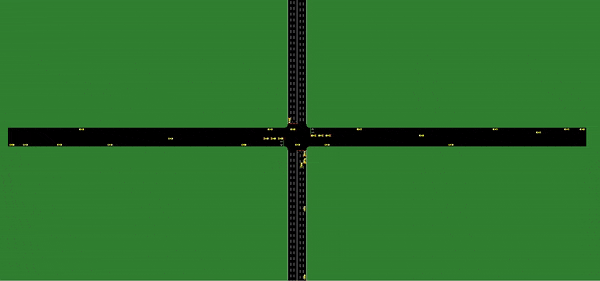
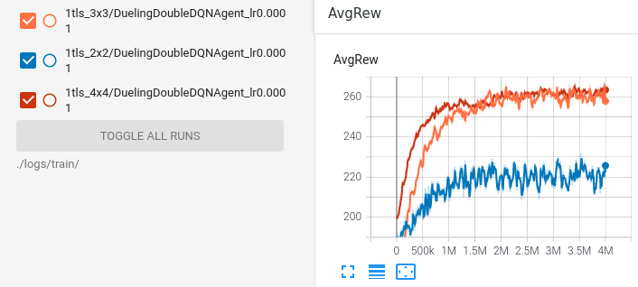

## DQN - Intelligent Traffic Signal Control with Partial Detection

Arxiv: http://arxiv.org/abs/2109.14337 (Romain Ducrocq, Nadir Farhi)  

****

Implemented from my DQN framework: https://github.com/romainducrocq/frameworQ  

****

### Build dependencies

make: `cd bin/ && bash make.sh`

1. Apt packages:  
> apt-get update && apt-get install build-essential libpq-dev libssl-dev openssl libffi-dev sqlite3 libsqlite3-dev libbz2-dev zlib1g-dev libxerces-c-dev libfox-1.6-dev libgdal-dev libproj-dev libgl2ps-dev git g++ cmake

2. Python 3.7.m:  
> m=0 && while wget -q --method=HEAD https<area>://www<area>.python.org/ftp/python/3.7.$(( $m + 1 ))/Python-3.7.$(( $m + 1 )).tar.xz; do m=$(( $m + 1 )); done && wget https<area>://www<area>.python.org/ftp/python/3.7.$m/Python-3.7.$m.tar.xz && tar xvf Python-3.7.$m.tar.xz && cd Python-3.7.$m && ./configure && make && make altinstall && cd .. && rm -rv Python-3.7.$m.tar.xz Python-3.7.$m  

3. Venv (venv):
> mkdir venv && python3.7 -m venv venv/  
> source venv/bin/activate  
> (venv) ... *Pip3 packages*  
> deactivate  

4. Pip3 packages:  
> (venv) export TMPDIR='/var/tmp'  
> (venv) pip3 install gym torch tensorboard 'msgpack==1.0.2' wheel --no-cache-dir  

5. Sumo:  
> cd venv/ && git clone --recursive https<area>://github<area>.com/eclipse/sumo && rm -rv $(find sumo/ -iname "*.git*")  
> mkdir sumo/build/cmake-build && cd sumo/build/cmake-build  
> cmake ../..  
> make -j$(nproc)  

****

### Demo

  

  

  
